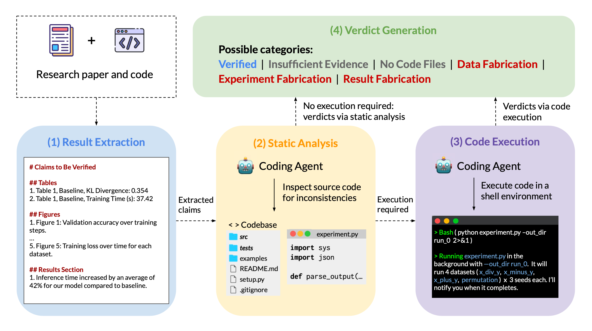
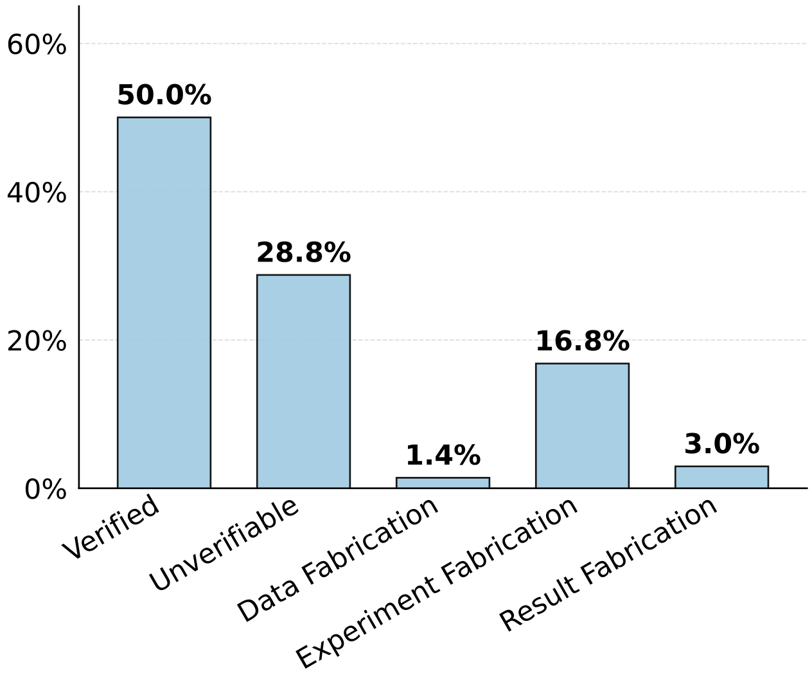
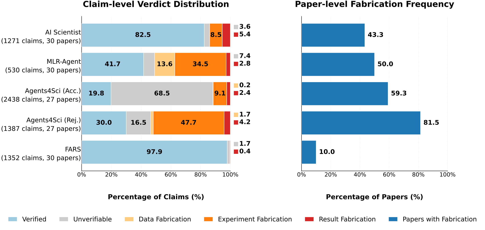

<p align="center">
  
</p>

<h2 align="center">
FabScore: Fine-Grained Evaluation of Fabrications in Automated AI Research
</h2>

[](https://opensource.org/license/mit-0)
[]()


## Introduction
**FabScore** is a fine-grained evaluation framework that measures the extent to which AI-generated papers contain fabrications. Given a research paper and its associate code, FabScore executes the following four stages by a coding agent: 1. **Result Extraction**; 2. **Static Analysis**; 3. **Code Execution**; 4. **Verdict Generation**.

<div align="center">
  </img>
  <br>
  <em>
      Figure 1: An overview of the FabScore framework, illustrating our four-stage evaluation pipeline.
  </em>
</div>
<br>

There are six verdict categories:
- **Data fabrication:** The input data referenced in the paper does not match what the code actually uses.
- **Experiment fabrication:** The experimental procedure described in the paper does not match what the code actually implements.
- **Result fabrication:** The reported results in the paper do not match those produced by actual execution.
- **No code files:** No relevant code files can be located, and the claim is thus Unverifiable.
- **Insufficient evidence:** Some relevant code can be located, but is insufficient to reach a definitive conclusion. The claim is thus also considered Unverifiable.
- **Verified:** The claim is supported by sufficient evidence from code analysis or execution.


## Evaluation Results

### Evaluation Data
we conduct a comprehensive evaluation on 144 papers with accompanying code from multiple sources, including [AI Scientist](https://github.com/sakanaai/ai-scientist), [MLR-Agent](https://github.com/chchenhui/mlrbench), [Agents4Science](https://agents4science.stanford.edu), and [FARS](https://analemma.ai/fars/). For Agents4Science, we collect all 27 accepted submissions with available code, and additionally sampled 27 rejected submissions to balance accepted and rejected papers. For AI Scientist MLR-Agent, and FARS, we collect 30 papers each.

### Overall Performance
As shown in Figure 2, the overall fabrication rate reaches 21.2%, where experiment fabrication accounts for the majority. 

<div align="left">
  </img>
  <br>
  <em>
      Figure 2: Proportion of each verdict category among 6,978 extracted claims from 144 AI-generated papers.
  </em>
</div>
<br>

### Claim-level and Paper-level Performance
As shown in Figure 3, claim-level fabrication rates range from 0.4% to 53.6% and paper-level rates from 10.0% to 81.5%. 70.4% of the 54 real conference submissions contain fabrications.

<div align="center">
  </img>
  <br>
  <em>
      Figure 3: Claim-level verdict distribution and paper-level fabrication frequency across five data sources, where paper-level fabrication frequency is defined as the proportion of papers containing at least one fabrication.
  </em>
</div>
<br>


### Review Interface
We have developed a unified interface to support human review. If you would like to check out the evaluation results using our interface, please click this [link](https://chchenhui.github.io/fabscore/fabscore_viewer.html).


## Repository Structure

```
fabscore/
├── fabscore/                    # Core Python package (evaluation pipeline)
│   └── eval/
│       ├── extraction.py        # Stage 1: Result extraction from paper
│       ├── analysis.py          # Stage 2: Static code analysis
│       ├── execution.py         # Stage 3: Code execution
│       └── summarization.py     # Stage 4: Verdict generation & result summarization
├── agents4sci_acc/              # Agents4Science accepted submissions (paper PDFs + code)
├── agents4sci_rej/              # Agents4Science rejected submissions (paper PDFs + code)
├── agents4sci_aireviews/        # AI-generated reviews for Agents4Science submissions
├── aiscientist_papers/          # AI Scientist papers (paper PDFs + code)
├── fars_papers/                 # FARS papers (paper PDFs + code)
├── mlragent_papers/             # MLR-Agent papers (paper Markdowns + code)
├── human_eval/                  # Human evaluation annotations
├── analysis/                    # Analysis scripts and aggregated results
├── plots/                       # Generated figures and plots
├── assets/                      # Images used in README and paper
├── main.py                      # Main orchestrator for the full 4-step pipeline
├── run_agents4sci_acc.sh        # Batch eval script for Agents4Science accepted papers
├── run_agents4sci_rej.sh        # Batch eval script for Agents4Science rejected papers
├── run_aiscientist_papers.sh    # Batch eval script for AI Scientist papers
├── run_fars_papers.sh           # Batch eval script for FARS papers
├── run_mlragent_papers.sh       # Batch eval script for MLR-Agent papers
├── download_aireviews.py        # Script to download AI reviews from OpenReview
├── generate_index_for_viewer.py # Script to build paper_index.json for the viewer
├── paper_index.json             # Index of all evaluated papers (used by viewer)
├── fabscore_viewer.html         # Web-based interface for browsing evaluation results
└── pyproject.toml               # Project dependencies (managed by uv)
```

## Installation
We use ```uv``` to manage the environment of this repository. Here are commands for initialing ```uv``` in this project.
```shell
1. uv init
2. uv venv
3. # add requirements to pyproject.toml
4. uv add requests
5. uv lock
# update packages: uv sync
```
Install ```fabscore``` as a package:
```shell
uv pip install -e .
```
Before running the following steps, ensure you have activated the virtual environment:
```shell
source .venv/bin/activate
```
You can also skip manual activation and run commands through `uv run`, which is the recommended style.

## Usage

The evaluation pipeline consists of **4 modular steps**. You can run them all at once using the main orchestrator, or individually for more control.

### Full Pipeline Run (Recommended)
Run the entire 4-step process automatically:
```shell
uv run python main.py --task_path <path_to_task_directory> --paper_filename <paper_filename_or_relative_path> [--judge_type claude]
```
Key optional arguments:
- `--judge_type` — Agent to use: `claude`, or `codex` (default: `claude`)
- `--model_name` — Model name override (e.g. `claude-sonnet-4-6`)
- `--extraction_only` — Stop after extraction
- `--analysis_only` — Stop after extraction + static analysis
- `--execution_only` — Stop after extraction + static analysis + execution, and skip final summarization writeout

Required arguments:
- `--task_path` — Task root directory
- `--paper_filename` — Paper filename or relative path inside the task directory, for example `paper.pdf`, `results/paper.md`, or `data_augmentation_grokking.pdf`


### Individual Step Usage

You may also execute each stage individually by running:
```shell
1. uv run python fabscore/eval/extraction.py --task_path <task_dir> --paper_filename <relative_paper_path> [--judge_type claude] [--model_name <model>]  # Result Extraction
2. uv run python fabscore/eval/analysis.py --task_path <task_dir> --paper_file <relative_paper_path> [--judge_type claude] [--model_name <model>]  # Static Analysis
3. uv run python fabscore/eval/execution.py --task_path <task_dir> --paper_file <relative_paper_path> [--analysis_path <analysis_json>] [--extracted_path <extracted_json>] [--judge_type claude]  # Code Execution
```

## Citation
Please cite our paper if you find our work helpful:
```bibtex
@article{chen2026fabscore,
      title={FabScore: Fine-Grained Evaluation of Fabrications in Automated AI Research}, 
      author={Chen, Hui and Zhao, James Xu and Jiang, Dongfu and Guo, Qianyun and Chen, Jiefeng and Wang, Yiwei and Chen, Muhao and Ng, See-Kiong and Koh, Pang Wei and Hooi, Bryan},
      link={https://github.com/chchenhui/fabscore},
      year={2026}
}
```
Please feel free to contact chchenhui233@gmail.com if you have any questions.
