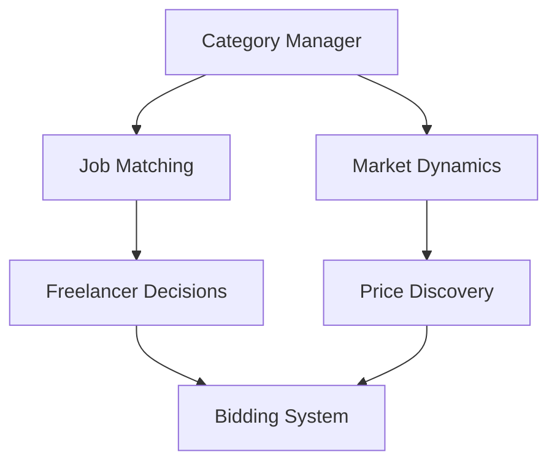
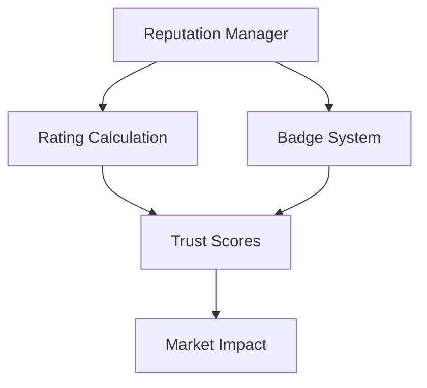
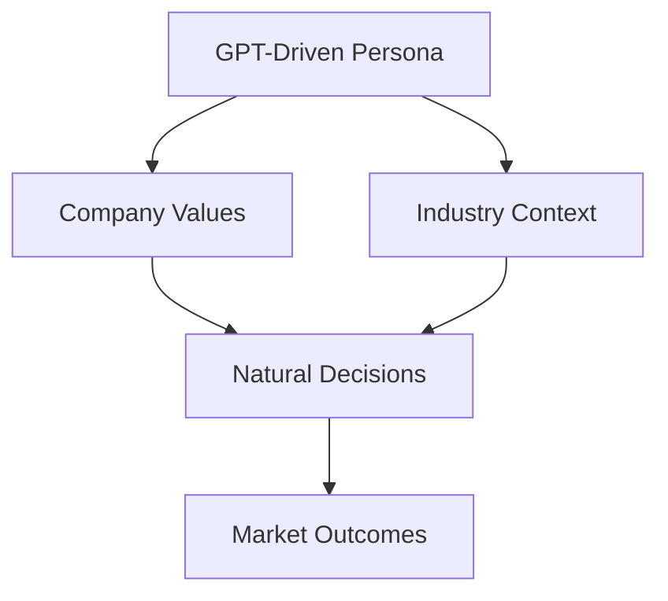
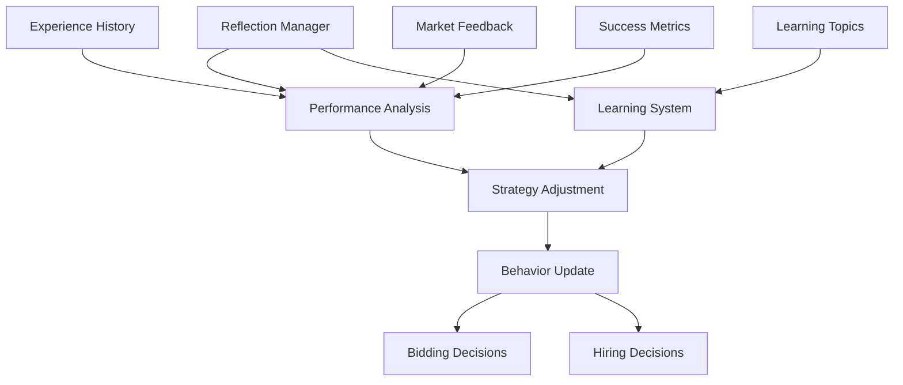
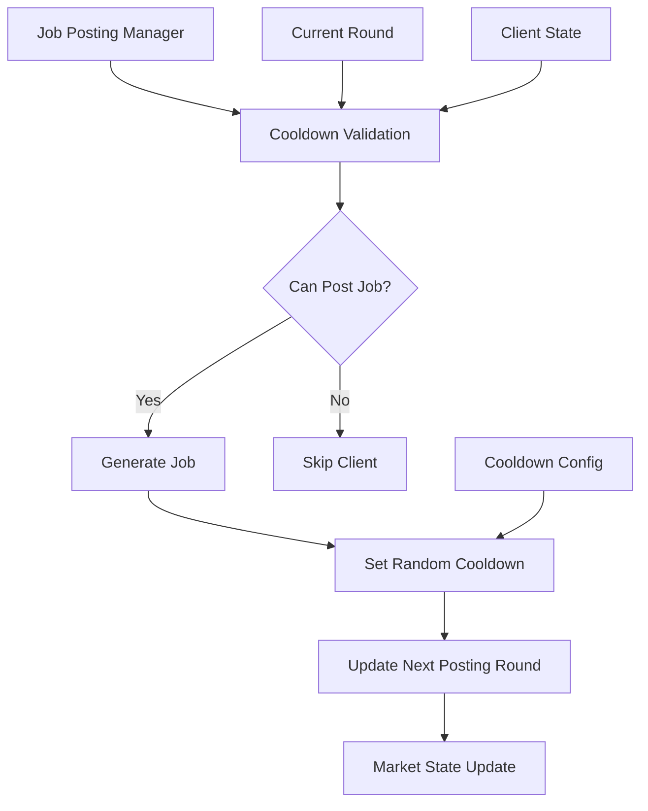
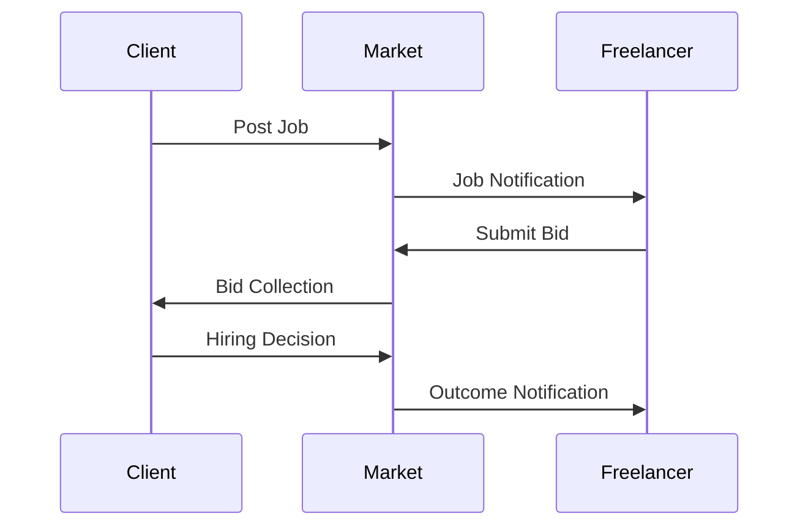
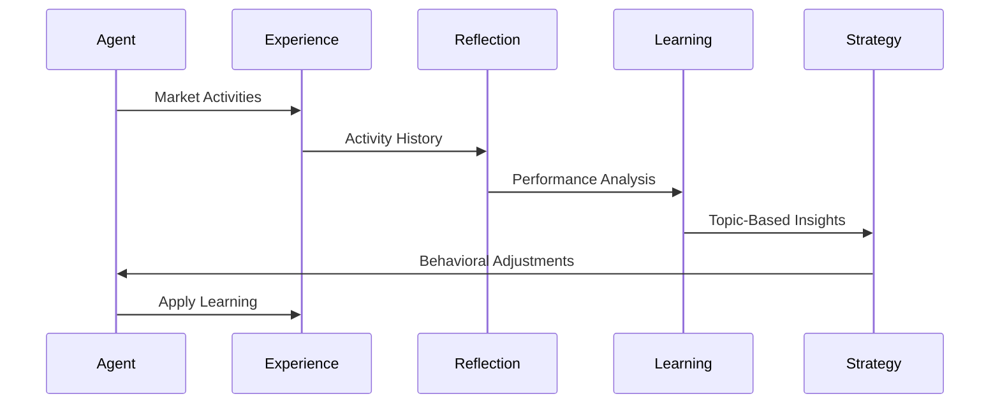

# Technical Architecture Documentation

## Overview
This document describes the technical architecture of the simulated marketplace system, including the tech stack, component interactions, and the division between agent-driven and human-designed components.

## Tech Stack

### Core Technologies
- **Python 3.9+**: Primary programming language
- **NumPy**: Numerical computations and data analysis
- **Matplotlib**: Data visualization and plotting
- **SciPy**: Statistical analysis and scientific computing
- **OpenAI GPT**: Large language model for agent behavior

### Development Tools
- **Git**: Version control
- **Cursor IDE**: Development environment
- **Make**: Build automation
- **pytest**: Testing framework

### Project Structure
```
simulated_marketplace/
├── src/                    # Core source code
│   ├── marketplace/       # Marketplace simulation
│   ├── analysis/         # Data analysis tools
│   ├── experiments/      # Experimental studies
│   └── caching/          # API caching system
├── config/                # Configuration files
├── docs/                  # Documentation
├── experimental_studies/  # Research studies
├── papers/               # Research papers
└── results/              # Simulation results
```

## Component Architecture

### Agent-Driven Components

1. **Freelancer Behavior**
   - Persona generation
   - Bidding decisions
   - Rate adjustments
   - Job selection
   - Strategy adaptation
   - Daily reflection

2. **Client Behavior**
   - Rich persona generation with industry context
   - Context-aware job posting creation
   - Configurable job posting cooldown periods
   - Value-driven hiring decisions
   - Natural preference development
   - Experience-based learning
   - Reflective adaptation

3. **Market Dynamics**
   - Price discovery
   - Competition levels
   - Supply/demand balance
   - Category-specific trends
   - Reputation effects

### Human-Designed Components

1. **System Architecture**
   - Component interfaces
   - Data structures
   - Event handling
   - State management
   - Performance optimization

2. **Analysis Framework**
   - Metrics definition
   - Data collection
   - Statistical analysis
   - Visualization tools
   - Report generation

3. **Research Framework**
   - Experiment design
   - Hypothesis testing
   - Control mechanisms
   - Validation methods
   - Result interpretation

## Component Interactions

### 1. Job Categories System


### 2. Reputation System


### 3. Client Persona System


### 4. Agent Reflection System


### 5. Job Posting Cooldown System


The Agent Reflection System has been enhanced with the following features:

1. **Performance Metrics**
   - Success rate tracking
   - Response rate analysis
   - Category-specific performance
   - Earnings trends

2. **Learning Mechanisms**
   - Topic-based learning (bidding, rates, skills)
   - Experience-driven insights
   - Strategy adaptation
   - Confidence tracking

3. **Decision Integration**
   - Reflection-informed bidding
   - History-aware hiring
   - Strategy adjustments
   - Risk assessment

4. **Feedback Loop**
   - Bid outcome analysis
   - Hiring decision review
   - Strategy effectiveness
   - Market adaptation

The Job Posting Cooldown System introduces the following capabilities:

1. **Configurable Posting Frequency**
   - Min/max cooldown range configuration (default: 3-10 rounds)
   - Random cooldown assignment within specified bounds
   - Prevents market flooding with realistic posting patterns

2. **Client State Management**
   - Per-client cooldown tracking
   - Next posting round calculation
   - Automatic posting eligibility validation

3. **Market Pacing Control**
   - Adjustable job supply rates for different market conditions
   - Research applications for studying market saturation effects
   - Command line and programmatic configuration options

## Data Flow

### 1. Market Activity Flow


### 2. Learning Flow


The enhanced learning flow incorporates:
1. **Experience Collection**
   - Market activities tracking
   - Success/failure recording
   - Feedback gathering
   - Performance metrics

2. **Reflection Process**
   - Historical analysis
   - Pattern recognition
   - Performance evaluation
   - Risk assessment

3. **Learning Outcomes**
   - Topic categorization
   - Strategy insights
   - Confidence metrics
   - Improvement areas

4. **Strategy Application**
   - Behavioral adjustments
   - Rate optimization
   - Skill development
   - Market positioning

## Agent Intelligence

### GPT Integration

#### Prompt Categories
1. **Decision Prompts**
   - Bidding decisions with reflection context
   - Hiring choices with learning history
   - Strategy adjustments with performance data
   - Risk assessment with market insights

2. **Reflection Prompts**
   - Performance analysis and metrics
   - Learning topic identification
   - Strategy effectiveness review
   - Confidence level assessment
   - Experience integration

3. **Learning Prompts**
   - Topic-based knowledge acquisition
   - Strategy optimization suggestions
   - Market pattern recognition
   - Category expertise development
   - Risk-reward analysis

#### Technical Integration
- **Prompt Engineering**: Carefully designed prompts for consistent behavior
- **Context Management**: Relevant history and state information
- **Response Parsing**: Structured output handling
- **Error Recovery**: Fallback mechanisms for API issues
- **Token Optimization**: Efficient prompt design and response handling

### Learning Mechanisms

1. **Reflection-Based Learning**
   - Daily performance analysis
   - Topic-based insights generation
   - Strategy effectiveness review
   - Confidence level tracking
   - Experience integration

2. **Direct Learning**
   - Success/failure analysis
   - Strategy adjustment
   - Performance tracking
   - Feedback incorporation
   - Risk assessment

3. **Market Learning**
   - Price discovery
   - Competition analysis
   - Trend recognition
   - Niche identification
   - Category expertise

4. **Emergent Learning**
   - Natural behavior development
   - Contextual understanding
   - Value-based decisions
   - Experience accumulation
   - Adaptive strategies

## Performance Considerations

### Optimization Strategies
1. **API Usage**
   - Request batching
   - Response caching
   - Token optimization
   - Rate limiting

2. **Computation**
   - Parallel processing
   - Lazy evaluation
   - Memory management
   - Resource pooling

3. **Data Management**
   - Efficient storage
   - Smart indexing
   - Cache strategies
   - Clean-up routines

## Testing Framework

### Test Categories
1. **Unit Tests**
   - Component behavior
   - Edge cases
   - Error handling
   - State management
   - Reflection metrics
   - Learning outcomes
   - Strategy adjustments

2. **Integration Tests**
   - Component interaction
   - Data flow
   - Event handling
   - System stability
   - Reflection integration
   - Learning feedback
   - Decision impact

3. **Simulation Tests**
   - Market scenarios
   - Agent behavior
   - Performance metrics
   - System scalability
   - Learning progression
   - Strategy evolution
   - Market adaptation

## Monitoring and Analysis

### Key Metrics
1. **System Metrics**
   - API usage
   - Response times
   - Error rates
   - Resource utilization

2. **Market Metrics**
   - Transaction volume
   - Price trends
   - Success rates
   - Category dynamics

3. **Agent Metrics**
   - Decision quality
   - Learning rates
   - Strategy effectiveness
   - Adaptation speed
   - Reflection insights
   - Topic-based learning
   - Confidence trends
   - Success progression
   - Category expertise
   - Rate optimization
   - Market positioning
   - Risk assessment

## Future Considerations

### Scalability
1. **Vertical Scaling**
   - Resource optimization
   - Performance tuning
   - Memory management
   - Processing efficiency

2. **Horizontal Scaling**
   - Distributed processing
   - Load balancing
   - Data partitioning
   - Service redundancy

### Extensibility
1. **New Features**
   - Plugin architecture
   - Module interfaces
   - Configuration system
   - Version management

2. **Research Extensions**
   - Experiment framework
   - Analysis tools
   - Visualization system
   - Report generation

## Security and Privacy

### Data Protection
1. **Access Control**
   - Authentication
   - Authorization
   - Role management
   - Session control

2. **Data Security**
   - Encryption
   - Secure storage
   - Safe transmission
   - Privacy compliance

## Maintenance

### Regular Tasks
1. **System Updates**
   - Dependency management
   - Version control
   - Documentation updates
   - Security patches

2. **Data Management**
   - Backup routines
   - Cache clearing
   - Log rotation
   - Storage optimization

3. **Performance Tuning**
   - Resource monitoring
   - Bottleneck identification
   - Optimization implementation
   - Benchmark testing
