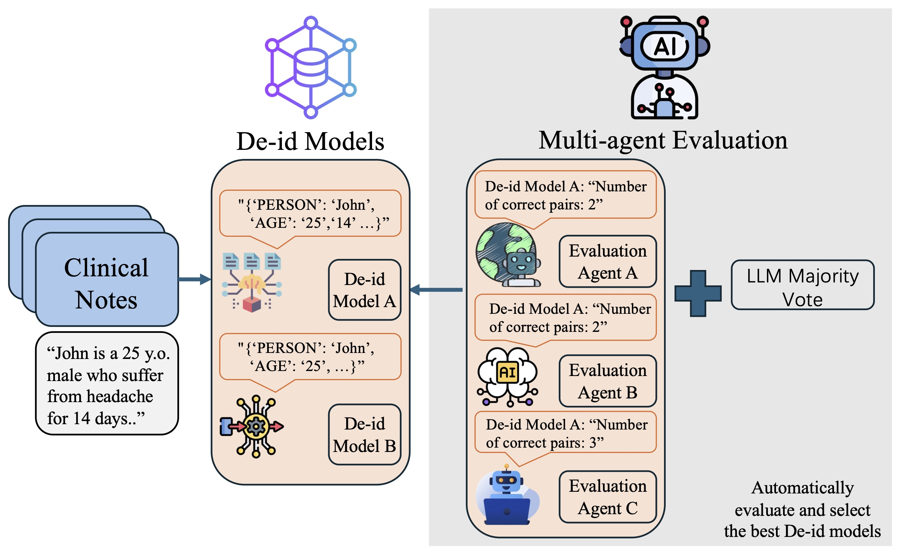

# TEAM-PHI
This repo contains our code for the paper "Towards Automatic Evaluation and Selection of PHI De-identification Models via Multi-Agent Collaboration".

## Task Description
This paper focuses on automatic evaluation and selection of PHI de-identification models for clinical notes. The aim is to identify the most reliable system for removing protected health information (PHI) such as names and dates without gold-standard annotations. Conventional expert-based evaluation is costly and hard to scale. Our setting requires privacy protection, consistent evaluation across diverse models, and robust ranking despite missing ground truth. To tackle these challenges, we propose **TEAM-PHI** (**T**rusted **E**valuation and **A**utomatic **M**odel selection for **PHI**), a multi-agent framework that uses large language models (LLMs) to evaluate PHI outputs and aggregate judgments into stable rankings.

## TEAM-PHI Framework
TEAM-PHI operates in three stages.

De-identification models: multiple De-id models produce structured PHI predictions from raw notes.

Evaluation Agents: independent LLM agents verify the correctness of each De-id model’s predictions, standardizing outputs and mitigating surface-form variation.

LLM Majority Voting: correctness counts from all evaluators are combined via independent and cross-informed voting to select the best-performing model.

This modular design enables automatic, reproducible model selection without gold labels, with experiments showing close agreement with human and supervised evaluations.

The overview of the TEAM-PHI framework is illustrated in the following figure.

    
    
Figure 1: Overview of our proposed TEAM-PHI framework.

## Package 
**["requirements.txt" file could be used to download the python packages automatically]**

* python==3.8.10

* editdistance==0.6.2

* fire==0.5.0

* numpy==1.19.5

* openai==0.28.1

* pandas==1.3.4

* rank_bm25==0.2.2

* scipy==1.12.0

* simstring-fast==0.3.0

* textdistance==4.6.1

* torch==1.10.0+cu111

* tqdm==4.66.1

* transformers==4.33.3

## Data
We use 100 fully annotated clinical notes provided by a major U.S. hospital, in which all PHI entities were manually identified by medical experts. These notes reflect real-world clinical documentation and include a wide range of patient information. Due to the sensitive nature of medical data and privacy regulations, these clinical notes are not publicly available. For questions regarding data use or evaluation protocols, please contact the author team.

For Deid models, we used Gemma2 [Gemma2 Link](https://huggingface.co/google/gemma-2-9b-it), Mistral-7B [Mistral Link](https://huggingface.co/mistralai/Mistral-7B-Instruct-v0.3), GPT models, Llama models [Llama-8b Link](https://huggingface.co/meta-llama/Meta-Llama-3-8B-Instruct), [Llama-70b Link](https://huggingface.co/meta-llama/Meta-Llama-3-70B-Instruct), and two finetuned models specifically designed for the PHI annotation task [LPPA4K Link](https://huggingface.co/spacebetweenus/108mix4ktest1), [LPPA5K Link](https://huggingface.co/spacebetweenus/107mix5k). All GPT models were accessed through Microsoft Azure’s HIPAA-compliant infrastructure [Azure Link](https://azure.microsoft.com/en-us/products/ai-services/openai-service), while all other experiments were conducted locally. In particular, Gemma2 and Mistral-7B were run on an Apple MacBook, whereas the Llama models and the two finetuned models were run on a server equipped with two H100 GPUs.

For Evaluation Agents, we used the same set of models: Gemma2, Mistral-7B, GPT models, and Llama models. Their usage settings mirrored those of the Deid models.

