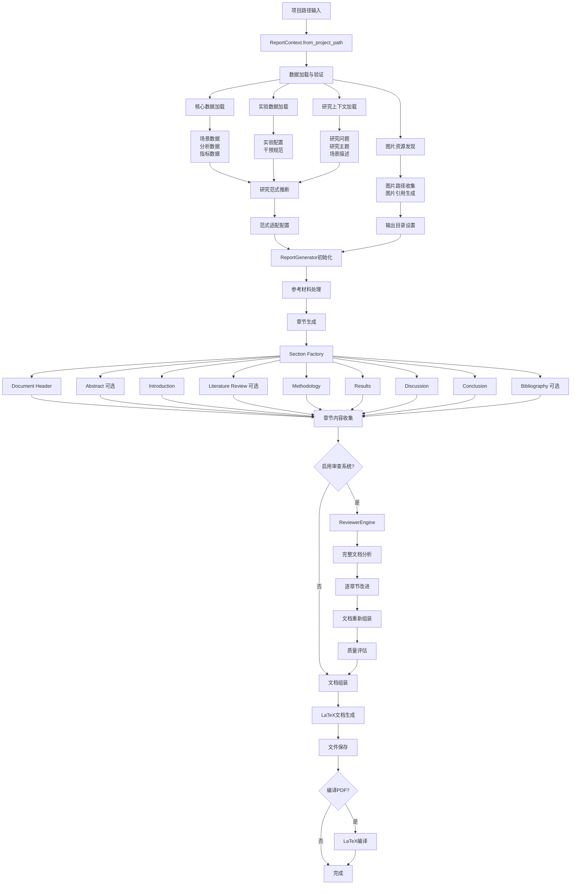
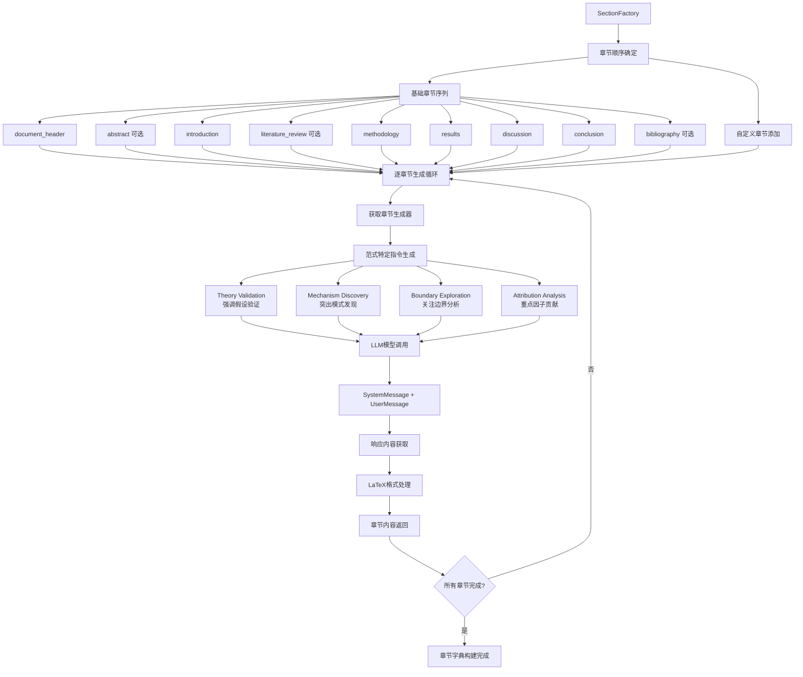
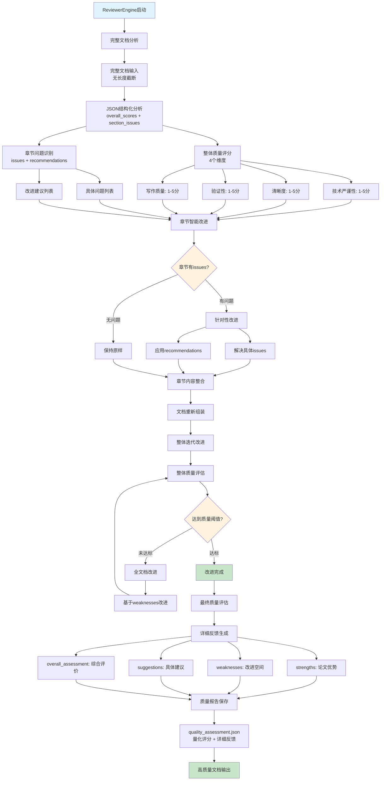

# Report Generation Module

统一的学术论文报告生成系统，专为 YuLan-OneSim 社会仿真项目设计，遵循 Linus Torvalds 的 "Good Taste" 原则 - 通过优雅的数据结构设计消除特殊情况，单一算法处理所有研究范式。

## 🏗️ 系统架构

### 核心组件架构图

```
┌─────────────────────────────────────────────────────────────────┐
│                    Report Generation System                      │
├─────────────────────────────────────────────────────────────────┤
│                                                                 │
│  ┌─────────────┐  ┌─────────────┐  ┌─────────────┐              │
│  │   Config    │  │   Context   │  │   Engine    │              │
│  │ 配置管理系统  │  │ 统一数据加载  │  │ 生成引擎     │              │
│  └─────────────┘  └─────────────┘  └─────────────┘              │
│         │                │                │                     │
│         └────────────────┼────────────────┘                     │
│                          │                                      │
│  ┌─────────────────────────────────────────────────────────┐    │
│  │                Section Factory                          │    │
│  │                章节生成工厂                              │    │
│  └─────────────────────────────────────────────────────────┘    │
│         │                                                       │
│  ┌──────┴─────┬─────────┬─────────┬─────────┬─────────┐         │
│  │ Document   │ Abstract│Introduction│Results│Discussion│        │
│  │ Header     │ 摘要     │ 引言      │ 结果   │ 讨论     │        │
│  └────────────┴─────────┴─────────┴─────────┴─────────┘         │
│                                                                 │
│  ┌─────────────────────────────────────────────────────────┐    │
│  │                Quality System                           │    │
│  │                质量保证系统                              │    │
│  ├─────────────┬─────────────┬─────────────┬─────────────┤    │
│  │ Reviewer    │ LaTeX       │ Literature  │ Citation    │    │
│  │ 审查引擎     │ 编译器       │ 查找引擎     │ 管理        │    │
│  └─────────────┴─────────────┴─────────────┴─────────────┘    │
└─────────────────────────────────────────────────────────────────┘
```

### 研究范式自动推理系统

系统基于实验设计自动推断研究范式，采用统一算法处理所有类型：

```
Input Data → Analysis → Paradigm Inference → Content Adaptation
     │           │            │                     │
实验数据  →  模式分析  →  范式推断  →  内容适配

支持的研究范式：
┌─────────────────────────────────────────────────────────────┐
│ 1. Theory Validation (T+C → O)                             │
│    理论验证：假设检验，演绎推理                                │
│    特征：有明确假设，控制变量，验证预期结果                     │
├─────────────────────────────────────────────────────────────┤
│ 2. Mechanism Discovery (O+C → T)                           │
│    机制发现：模式检测，归纳推理                                │
│    特征：观察现象，识别模式，构建理论解释                      │
├─────────────────────────────────────────────────────────────┤
│ 3. Boundary Exploration (T+O → C_boundary)                 │
│    边界探索：参数敏感性分析                                   │
│    特征：参数扫描，阈值识别，边界条件分析                      │
├─────────────────────────────────────────────────────────────┤
│ 4. Attribution Analysis (T+O → C_weight)                   │
│    归因分析：因子贡献分析                                     │
│    特征：多因子实验，贡献度量，敏感性分析                      │
└─────────────────────────────────────────────────────────────┘
```

## 🔄 完整生成流程图

### 主流程图



### 数据加载详细流程

```mermaid
graph TD
    A[项目根目录] --> B[核心数据加载]

    B --> B1[场景数据搜索]
    B1 --> B1a[base_scenario/scene_info.json]
    B1 --> B1b[base_scenario/scenario_config.json]
    B1 --> B1c[scene_info.json]
    B1 --> B1d[{project_name}.json]

    B --> B2[分析数据加载]
    B2 --> B2a[analysis/data_analysis.json]
    B2 --> B2b[analysis/figure_analysis.json]
    B2 --> B2c[analysis/analysis_report.json]

    B --> B3[实验数据加载]
    B3 --> B3a[experiment_design/experiment_config.json]
    B3 --> B3b[experiment_design/intervention_specifications.json]

    B --> B4[研究上下文加载]
    B4 --> B4a[workflow_state.json]
    B4a --> B4a1[research_question]
    B4a --> B4a2[research_topic]
    B4a --> B4a3[scenario_description]
    B4a --> B4a4[research_paradigm]

    B --> B5[图片发现]
    B5 --> B5a[analysis/figures/*.png]
    B5 --> B5b[groups/*/runs/*/metrics_plots/*.png]

    B1a --> C[数据验证与整合]
    B1b --> C
    B1c --> C
    B1d --> C
    B2a --> C
    B2b --> C
    B2c --> C
    B3a --> C
    B3b --> C
    B4a1 --> C
    B4a2 --> C
    B4a3 --> C
    B4a4 --> C
    B5a --> C
    B5b --> C

    C --> D[Context对象构建完成]
```

### 章节生成详细流程



### 质量审查系统流程



## 📁 项目结构要求

系统要求项目遵循以下标准结构：

```
project_dir/                              # 项目根目录
├── workflow_state.json                   # 研究上下文（必需）
│   ├── research_question                 # 研究问题
│   ├── research_topic                    # 研究主题
│   ├── scenario_description              # 场景描述
│   └── research_paradigm                 # 研究范式（可选）
│
├── base_scenario/                        # 基础场景定义
│   ├── scene_info.json                  # 场景信息（必需）
│   └── scenario_config.json             # 场景配置（可选）
│
├── experiment_design/                    # 实验设计
│   ├── experiment_config.json           # 实验配置
│   └── intervention_specifications.json # 干预规范
│
├── analysis/                            # 分析结果
│   ├── data_analysis.json              # 数据分析结果
│   ├── figure_analysis.json            # 图表分析
│   └── figures/                         # 图表文件目录
│       └── *.png                        # 生成的图表
│
├── groups/                              # 实验组数据（可选）
│   └── */runs/*/metrics_plots/         # 历史指标图表
│       └── *.png
│
├── references/                          # 参考材料（可选）
│   └── *.pdf                           # 参考论文PDF
│
└── reports/                             # 输出目录（自动创建）
    ├── report.tex                      # 生成的LaTeX报告
    ├── report.bib                      # 参考文献
    ├── quality_assessment.json         # 质量评估报告
    ├── project_outline.md              # 项目特定大纲
    └── figures/                         # 复制的图表文件
        └── figure_*.png
```

## 🚀 使用方法

### 命令行接口

```bash
# 基础使用
python report_generation_cli.py --project /path/to/project --output report.tex

# 完整配置使用
python report_generation_cli.py \
    --project /path/to/project \
    --output report.tex \
    --title "社会动力学研究" \
    --author "研究团队" \
    --language zh \
    --enable-review \
    --compile-pdf

# 使用参考材料
python report_generation_cli.py \
    --project /path/to/project \
    --output report.tex \
    --reference-paper references/example.pdf \
    --outline-template templates/outline.md \
    --model-config vllm-qwen-7

# 高质量报告生成
python report_generation_cli.py \
    --project /path/to/project \
    --output report.tex \
    --enable-review \
    --max-review-iterations 3 \
    --include-literature-review \
    --include-bibliography \
    --language zh
```

### 编程接口

```python
from researcher.report_generation import (
    ReportGenerator, ReportConfig, ReportContext, ResearchParadigm
)

# 方式一：最简使用
def simple_usage():
    context = ReportContext.from_project_path("/path/to/project")
    config = ReportConfig(title="研究报告", author="AI研究员")

    generator = ReportGenerator(config)
    content = generator.generate(context, "output.tex")
    return content

# 方式二：完整配置
def advanced_usage():
    # 1. 加载项目上下文
    context = ReportContext.from_project_path(
        "/path/to/project",
        model_config_name="vllm-qwen-7"
    )

    # 2. 创建配置
    config = ReportConfig(
        title="社会仿真研究报告",
        author="AI研究团队",
        language="zh",
        include_abstract=True,
        include_literature_review=True,
        include_bibliography=True,
        enable_review=True,
        max_review_iterations=3,
        compile_pdf=True,
        quality_thresholds={
            "technical_rigor": 3.5,
            "clarity": 3.0,
            "novelty": 3.0,
            "validation": 3.5,
            "writing_quality": 3.0
        }
    )

    # 3. 设置参考材料
    config.reference_paper_path = "/path/to/reference.pdf"
    config.outline_template_path = "/path/to/outline.md"

    # 4. 生成报告
    generator = ReportGenerator(config)
    content = generator.generate(context, "output.tex")

    # 5. 检查质量评估
    quality_file = context.output_dir / "quality_assessment.json"
    if quality_file.exists():
        import json
        with open(quality_file) as f:
            quality_data = json.load(f)
        print(f"Overall Quality Score: {quality_data['overall_score']:.2f}")
        print(f"Quality Level: {quality_data['quality_level']}")

    return content

# 方式三：流式处理
def streaming_usage():
    """支持大型项目的流式处理"""
    context = ReportContext.from_project_path("/large/project")

    # 分步骤配置
    config = ReportConfig()
    config.set_paradigm(ResearchParadigm.MECHANISM_DISCOVERY)

    generator = ReportGenerator(config)

    # 可以单独生成各个部分
    sections = generator._generate_sections_dict(context)

    # 逐步改进
    if config.enable_review:
        improved_sections = generator.reviewer._review_and_improve_sections(
            sections, {}, context
        )
        final_content = generator._assemble_document_from_sections(
            improved_sections, context
        )
    else:
        final_content = generator._assemble_document_from_sections(
            sections, context
        )

    return final_content
```

### 集成到研究流程

```python
# 与 AI Social Researcher 集成
def integrated_research_workflow():
    """完整的研究-报告生成流程"""

    # 1. 执行研究流程
    from researcher import Researcher

    researcher = Researcher()
    project_path = researcher.execute_research_workflow(
        topic="社会网络动力学",
        project_name="social_dynamics_study"
    )

    # 2. 自动生成报告
    context = ReportContext.from_project_path(project_path)

    # 基于研究范式自动配置
    if context.paradigm == ResearchParadigm.THEORY_VALIDATION:
        config = ReportConfig(
            title=f"{context.research_topic} - 理论验证研究",
            include_literature_review=True,
            enable_review=True,
            language="zh"
        )
    elif context.paradigm == ResearchParadigm.MECHANISM_DISCOVERY:
        config = ReportConfig(
            title=f"{context.research_topic} - 机制发现研究",
            include_abstract=True,
            enable_review=True,
            max_review_iterations=2,
            language="zh"
        )
    else:
        config = ReportConfig(title=context.research_topic, language="zh")

    # 3. 生成报告
    generator = ReportGenerator(config)
    report_content = generator.generate(context, "final_report.tex")

    print(f"研究完成！报告已保存至: {context.output_dir}")
    return report_content
```

## ⚙️ 配置选项

### ReportConfig 完整参数

```python
class ReportConfig:
    """报告生成配置类"""

    # 基础设置
    title: str = "Research Report"              # 报告标题
    author: str = "AI Researcher"               # 作者信息
    language: str = "en"                        # 语言 ("en" | "zh")

    # 内容控制
    include_abstract: bool = False              # 包含摘要
    include_literature_review: bool = False     # 包含文献综述
    include_bibliography: bool = False          # 包含参考文献
    custom_sections: List[str] = []             # 自定义章节

    # 质量控制
    enable_review: bool = False                 # 启用审查系统
    max_review_iterations: int = 2              # 最大审查迭代次数
    quality_thresholds: Dict[str, float] = {    # 质量阈值
        "technical_rigor": 3.0,
        "clarity": 3.0,
        "novelty": 2.5,
        "validation": 3.0,
        "writing_quality": 3.0
    }

    # 模型设置
    model_config_name: str = "vllm-qwen-7"     # 模型配置名称

    # 参考材料
    reference_paper_path: Optional[str] = None  # 参考论文路径
    outline_template_path: Optional[str] = None # 大纲模板路径

    # 输出控制
    compile_pdf: bool = False                   # 编译PDF
    clean_aux_files: bool = True                # 清理辅助文件
    latex_engine: str = "xelatex"               # LaTeX引擎
```

### 研究范式配置映射

```python
# 系统会根据实验数据自动推断，也可手动设置
paradigm_configs = {
    ResearchParadigm.THEORY_VALIDATION: {
        "focus": "假设验证和理论确认",
        "sections_emphasis": {
            "methodology": "实验设计和假设设定",
            "results": "假设检验结果和统计验证",
            "discussion": "理论确认和假设支持度分析"
        }
    },

    ResearchParadigm.MECHANISM_DISCOVERY: {
        "focus": "模式识别和机制发现",
        "sections_emphasis": {
            "methodology": "观察方法和数据收集",
            "results": "发现的模式和新兴行为",
            "discussion": "机制解释和理论构建"
        }
    },

    ResearchParadigm.BOUNDARY_EXPLORATION: {
        "focus": "边界条件和参数敏感性",
        "sections_emphasis": {
            "methodology": "参数扫描和边界测试",
            "results": "阈值识别和敏感性分析",
            "discussion": "边界条件的理论意义"
        }
    },

    ResearchParadigm.ATTRIBUTION_ANALYSIS: {
        "focus": "因子贡献和归因分析",
        "sections_emphasis": {
            "methodology": "多因子实验设计",
            "results": "因子贡献度和交互效应",
            "discussion": "归因机制和相对重要性"
        }
    }
}
```

## 🔧 高级功能

### 参考材料智能处理

```python
# 系统自动处理参考材料的完整流程
def reference_processing_workflow():
    """参考材料处理工作流"""

    # 1. PDF内容提取
    pdf_content = extract_pdf_to_markdown(pdf_path)

    # 2. LLM分析生成大纲
    outline = generate_outline_from_reference(pdf_content)

    # 3. 项目特定大纲生成
    project_outline = generate_project_specific_outline(
        reference_outline=outline,
        project_context=context
    )

    # 4. 引用信息提取
    citations = extract_citations_from_reference(pdf_content)

    # 5. 缓存机制
    cache_reference_materials(pdf_path, outline, citations)

    return outline, citations
```

### 图表自动集成

```python
# 图表发现和处理流程
def figure_integration_workflow():
    """图表集成工作流"""

    # 1. 图表发现
    image_paths = discover_images_from_analysis()

    # 2. 图表复制和重命名
    image_references = copy_images_to_output_directory()

    # 3. 自动标题生成
    for img_ref in image_references:
        img_ref["caption"] = generate_figure_caption(img_ref)
        img_ref["label"] = generate_figure_label(img_ref)

    # 4. LaTeX代码生成
    latex_figures = generate_latex_figure_code(image_references)

    return latex_figures
```

### 质量评估体系

```python
# 多维度质量评估
quality_dimensions = {
    "technical_rigor": {
        "description": "方法学严谨性，验证完整性",
        "criteria": [
            "实验设计合理性",
            "统计分析正确性",
            "结果验证充分性",
            "方法论一致性"
        ]
    },

    "clarity": {
        "description": "结构清晰性，可读性，逻辑流程",
        "criteria": [
            "章节组织合理性",
            "逻辑流程清晰性",
            "语言表达准确性",
            "术语使用一致性"
        ]
    },

    "novelty": {
        "description": "贡献重要性，创新水平",
        "criteria": [
            "研究问题新颖性",
            "方法创新性",
            "发现重要性",
            "理论贡献度"
        ]
    },

    "validation": {
        "description": "实验设计，结果支持度",
        "criteria": [
            "实验设计充分性",
            "数据质量",
            "结果可重现性",
            "证据支持强度"
        ]
    },

    "writing_quality": {
        "description": "学术写作风格，语言精确性",
        "criteria": [
            "学术语言规范性",
            "表达精确性",
            "引用格式正确性",
            "整体写作流畅性"
        ]
    }
}
```

## 🚨 错误处理与故障排除

### 常见问题及解决方案

```python
# 1. 数据文件缺失
class MissingDataError(Exception):
    """数据文件缺失错误"""
    pass

def handle_missing_data():
    """处理数据文件缺失"""
    issues = context.validate()
    if issues:
        logger.warning(f"发现数据问题: {issues}")
        # 提供默认数据或提示用户

# 2. 模型调用失败
def handle_model_failure():
    """处理模型调用失败"""
    try:
        model = get_model(config_name)
    except Exception as e:
        logger.warning(f"主模型失败: {e}, 使用备用模型")
        model = get_model(None)  # 默认模型

# 3. LaTeX编译错误
def handle_latex_error():
    """处理LaTeX编译错误"""
    if not latex_compiler.compile_to_pdf(tex_file):
        logger.error("PDF编译失败，请检查:")
        logger.info("- 是否安装LaTeX (xelatex/pdflatex)")
        logger.info("- 是否安装中文支持包 (ctex)")
        logger.info("- 数学符号格式是否正确")

# 4. 内存不足处理
def handle_memory_issues():
    """处理内存不足问题"""
    # 分块处理大文档
    # 启用流式生成
    # 减少并发调用
```

### 调试模式

```python
# 启用详细日志
import logging
logging.basicConfig(level=logging.DEBUG)

# 保存中间结果
config.save_intermediate_results = True

# 跳过某些步骤进行调试
config.skip_review = True
config.skip_pdf_compilation = True
```

## 📈 性能优化

### 缓存策略

```python
# 1. 参考材料缓存
- PDF大纲缓存: {pdf_name}_outline.md
- 引用信息缓存: {pdf_name}_citations.json

# 2. 模型响应缓存
- 章节内容缓存: sections/{section_name}_cache.txt
- 质量评估缓存: quality_cache.json

# 3. 图表处理缓存
- 图表标题缓存: figure_captions.json
- LaTeX代码缓存: latex_figures.tex
```

### 并行处理

```python
# 支持的并行操作
parallel_operations = [
    "章节生成并行化",      # 独立章节可并行生成
    "图表处理并行化",      # 多个图表同时处理
    "质量评估并行化",      # 多维度并行评估
    "参考材料并行处理"     # 多个PDF并行分析
]
```

## 🎯 最佳实践

### 1. 项目结构最佳实践

```bash
# 推荐的项目组织结构
project_name/
├── 00_setup/
│   ├── workflow_state.json      # 必需：研究上下文
│   └── research_plan.md        # 可选：研究计划
├── 01_scenario/
│   ├── base_scenario/
│   └── scene_info.json
├── 02_experiment/
│   ├── experiment_design/
│   └── results/
├── 03_analysis/
│   ├── analysis/
│   ├── figures/                # 重要：图表统一存放
│   └── data/
├── 04_references/              # 重要：参考材料
│   ├── reference_paper.pdf
│   └── outline_template.md
└── 05_reports/                 # 自动生成
    ├── report.tex
    └── quality_assessment.json
```

### 2. 配置最佳实践

```python
# 不同类型研究的推荐配置
def get_recommended_config(research_type: str) -> ReportConfig:
    """获取推荐配置"""

    if research_type == "theory_validation":
        return ReportConfig(
            include_literature_review=True,    # 理论验证需要文献支持
            enable_review=True,                # 严格质量控制
            quality_thresholds={
                "technical_rigor": 3.5,        # 高技术要求
                "validation": 3.5              # 高验证要求
            }
        )

    elif research_type == "exploratory":
        return ReportConfig(
            include_abstract=True,             # 探索性研究需要摘要
            max_review_iterations=3,           # 多次迭代优化
            quality_thresholds={
                "clarity": 3.5,               # 高清晰度要求
                "writing_quality": 3.5        # 高写作要求
            }
        )

    elif research_type == "application":
        return ReportConfig(
            compile_pdf=True,                  # 应用研究需要PDF
            include_bibliography=True,         # 完整参考文献
            language="zh"                      # 中文报告
        )
```


